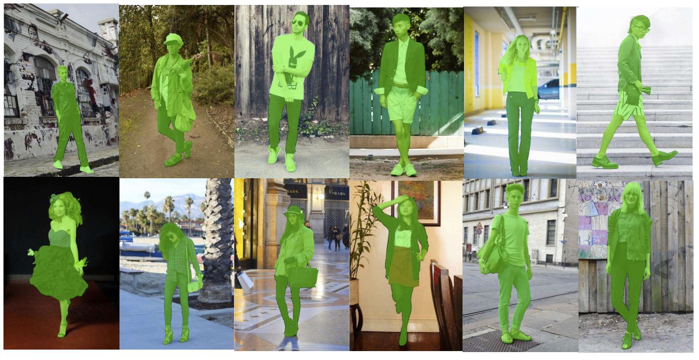

# ATR_RemoveBG

This is a dataset for **accurate** single human segmentation.

 Some examples of the images loaded by `loader.py` (with aug).

## Download

- trainset: [link](https://drive.google.com/open?id=1jDUddrJlUlv5O_JAdb8qZk45EwtEqf_4)
- valset: [link](https://drive.google.com/open?id=1FPqz2P51sbnWo1K2FcowPnZCAGC1-_uY)
- testset (no annotation): [link](https://drive.google.com/open?id=1gPkkqwiXKaPWLIIrF7QfvHHOu0B3zDjB)

## Api

See `loader.py`
